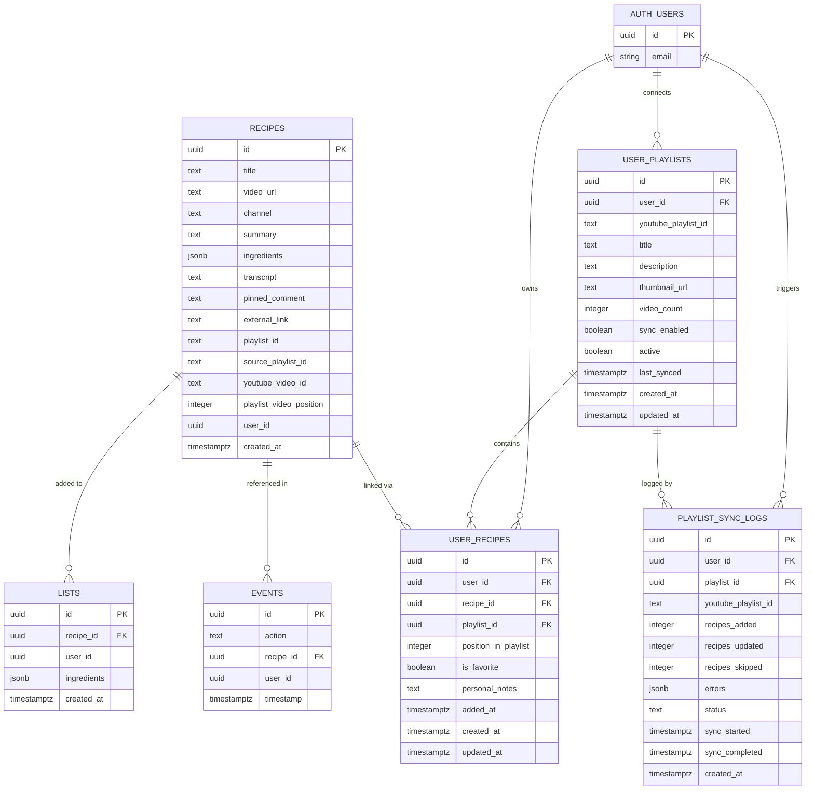

# Recipe Loop MVP — Entity Relationship Diagram

---

## Notes

### Global vs user-scoped tables

| Table | Scoped to user? | How |
|---|---|---|
| `recipes` | Loosely — has a `user_id` column but it's legacy | Should be global under Phase 2.3 architecture |
| `user_playlists` | Yes | `user_id` FK → `auth.users` |
| `user_recipes` | Yes | `user_id` FK → `auth.users` |
| `lists` | Yes | `user_id` column (no FK enforced) |
| `events` | Yes | `user_id` column (no FK enforced) |
| `playlist_sync_logs` | Yes | `user_id` FK → `auth.users` |

### Known inconsistencies

- **`recipes.user_id`** is a legacy column. Under the Phase 2.3 architecture, `recipes` is meant to be a global deduplicated table (no user context) — user ownership is tracked entirely via `user_recipes`. The column still exists but conflicts with that design.
- **`lists.user_id` and `events.user_id`** have no foreign key constraint to `auth.users`, unlike the newer tables.
- **RLS policies** are currently permissive (`FOR ALL USING (true)`) — the user_id columns exist but are not enforced at the database level yet.
